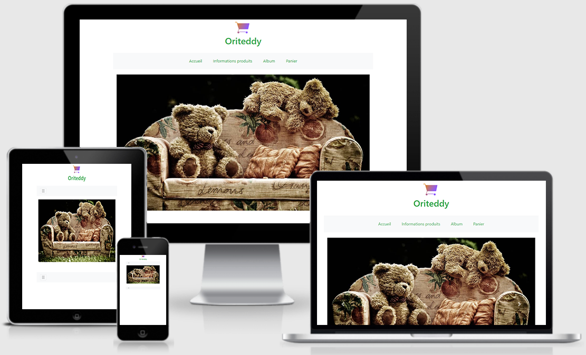

# Projet n°4 : Construire un site e-commerce

## :mag: Aperçu

## :bookmark_tabs: Sommaire
<ol>
    <li><a href="#sujet">Sujet</a></li>
    <li><a href="#demandes_respecter">Demandes à respecter</a></li>
    <li><a href="#objectifs_projet">Objectifs du projet</a></li>
    <li><a href="#technologies_utilisees">Technologies utilisées</a></li>
    <li><a href="#prerequis">Prérequis</a></li>
    <li><a href="#installation">Installation</a></li>
    <li><a href="#utilisation_siteweb">Utilisation du site web</a></li>
    <li><a href="#auteurs_contributeurs">Auteurs et contributeurs</a></li>
    <li><a href="#licence">Licence</a></li>
</ol>

## :page_facing_up: 1. Sujet 

Félicitations ! Vous avez été recruté en tant que développeur front-end par Orinoco, une entreprise de commerce en ligne.

Son credo ? Se démarquer des grands site e-commerce comme Amazon en créant des applications thématiques ne vendant qu’un seul groupe de produits. Il y a par exemple Oribook pour les livres ou Oritextil pour les vêtements.

Vos compétences en développement web et votre personnalité ont plu à Paul, le fondateur de l’entreprise.

Dans un premier temps, Paul souhaite créer un premier MVP pour démontrer le fonctionnement de ses applications à ses investisseurs.

L’équipe est constituée de Jeanne, développeuse back-end travaillant sur les API et vous, pour la partie front-end.

## :memo: 2. Demandes à respecter 

* Créer un premier MVP du site e-commerce pour démontrer le fonctionnement des applications à des investisseurs potentiels.
* Utiliser le localStorage pour le panier.
* Utiliser les paramètres de requête de l'URL pour la page "produit".

## :checkered_flag: 3. Objectifs du projet 

Apprendre à utiliser JavaScript tout en respectant les bonnes nomenclatures et pratiques.

## :computer: 4. Technologies utilisées 

* HTML
* Bootstrap
* CSS
* JavaScript
* Node.js
* Photoshop
* Git & GitHub

## :exclamation: 5. Prérequis 

Node et "npm" installé localement sur la machine.

## :wrench: 6. Installation 

* Cloner ce repository.
* Depuis le dossier du projet, exécuter npm install et npm install -g sass.
* Exécuter le serveur avec node server. Le serveur doit fonctionner sur localhost avec le port par défaut 3000.
* Si le serveur fonctionne sur un autre port pour quelque raison que ce soit, c'est indiqué sur la console au démarrage du serveur. Regarder sur le port 3001.

## :question: 7. Utilisation du site web 

Ouvrir le fichier index.html sur un navigateur web.

## :beers: 8. Auteurs et Contributeurs 

Timoté Lancelle : [GitHub](https://github.com/LancelleTimote) / [LinkedIn](https://www.linkedin.com/in/timote-lancelle-devweb/)

## :page_with_curl: 9. Licence 

Distribué sous la licence MIT. Voir le fichier [LICENSE](LICENSE) pour plus d'informations.